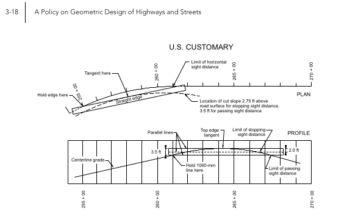
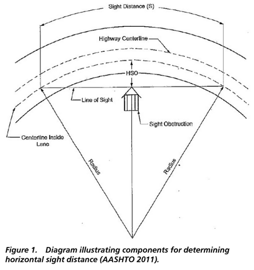

# Horizontal Sight Distance

Motor vehicle operators must be able to see ahead to safely react to
highway conditions that require stopping or changing speed or direction.
This application is meant to facilitate the common calculations of
stopping sight distance, clear offsets, and decision sight distance.

## Stopping Sight Distance

*Stopping sight distance is the sum of two distances: (1) the distance traversed by the vehicle
from the instant the driver sights an object necessitating a stop to the instant the brakes are ap-
plied, and (2) the distance needed to stop the vehicle from the instant brake application begins.
These are referred to as brake reaction distance and braking distance, respectively.*

*- A Policy on Geometric Design of Highways and Streets 7th Ed. (AASHTO, 2018)*

Stopping sight distance is calculated as follows:

$$SSD = 1.47Vt + 1.075\frac{V^2}{a}$$

where:

- SSD = stopping sight distance
- V = velocity (mph)
- t = reaction time (2.5s)
- a = deceleration rate (11.2ft/s2)

## Horizontal Sight Offset

*On a tangent roadway, the obstruction that limits the driver’s sight distance is the road surface at
some point on a crest vertical curve. On horizontal curves, the obstruction that limits the driver’s
sight distance may be the road surface at some point on a crest vertical curve or it may be some
physical feature outside of the traveled way, such as a longitudinal barrier, a bridge-approach
fill slope, a tree, foliage, or the backslope of a cut section. Accordingly, all highway construction
plans should be checked in both the vertical and horizontal plane for sight distance obstructions.*

*- A Policy on Geometric Design of Highways and Streets 7th Ed. (AASHTO, 2018)*

Horizontal sight offset is a common roadway design calculation that measures
the distance from the traveled way that should be free of obstruction
for a curve of a given radius and design speed.

This application computes horizontal sight offsets as the saggita of a
circular arc as measured from the middle of the lane. Half the lane
width is then subtracted to give the required unobstructed distance
from the edge of the traveled way. This may control cross-sectional
elements such as the edge of outside shoulder or limit grading above
a driver's sightline.

$$
s = r - \sqrt{\frac{r^2}{\frac{c^2}{4}}}
$$

where:

- s = saggita (ft) (distance from the chord to the arc. Also called HSO)
- r = radius (ft)
- c = chord-length (ft) (stopping sight distance)

$$r_{e} = r - m - l_{w}(n-\frac{1}{2})$$

$$Offset = s - \frac{1}{2}w_{l}$$

where:

- re = effective radius at travel path (ft)
- m = median width (ft)
- lw = lane width (ft)
- n = number of lanes
- s = saggita (ft) (of effective radius and SSD)
- Offset = Clear shoulder distance (ft)

## Decision Sight Distance

*Decision sight distance is the distance needed for a driver to detect an unexpected or otherwise
difficult-to-perceive information source or condition in a roadway environment that may be visually
cluttered, recognize the condition or its potential threat, select an appropriate speed and
path, and initiate and complete complex maneuvers (11). Because decision sight distance offers
drivers additional margin for error and affords them sufficient length to maneuver their vehicles
at the same or reduced speed, rather than to just stop, its values are substantially greater than
stopping sight distance.*

*- A Policy on Geometric Design of Highways and Streets 7th Ed. (AASHTO, 2018)*

Decision sight distance calculations include five categories:

1. A: Stop on a road in a rural area (t=3.0s)
2. B: Stop on a road in an urban area (t=9.1s)
3. C: Speed/path/direction change on a rural road (10.2s < t < 11.2s)
4. D: Speed/path/direction change on suburban road or street (12.1s < t < 12.9s)
5. E: Speed/path/direction change on urban core or rural town road or street (14.0s < t 14.5s)

Categories A and B are calculated with the same equation as stopping
sight distance; however, the pre-maneuver time is the value given in
the list above.

$$DSD = 1.47Vt + 1.075\frac{V^2}{a}$$

Categories C, D, and E are calculated with t as the sum of pre-maneuver
and maneuver time at the given design speed (the vehicle does not come
to a stop).

$$DSD = 1.47Vt$$